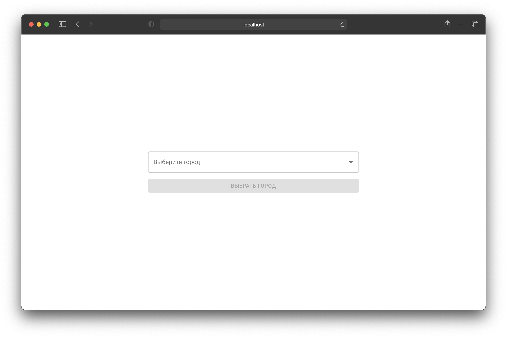
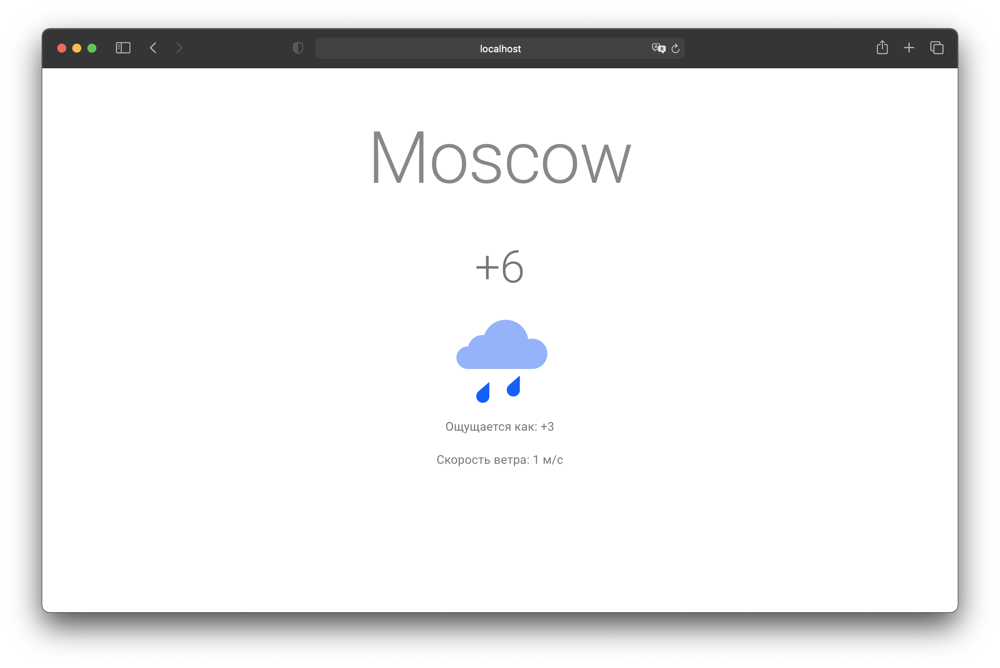

# Weather

Приложение для просмотра погоды.

<p align="center">
  
  
</p>

## Установка проекта

Зарегистрируйтесь на [сервисе погоды](https://yandex.ru/dev/weather/).

Выберите Тариф «Погода на вашем сайте».

`Яндекс создает токен в течении 30 минут, так что не удивляйтесь если создадите токен, а данные не приходят`

Скопируйте `.env.example` и переименуйте его в `.env`.

```bash
$ cp ./.env.example ./.env
```

Подставьте в значение `WEATHER_API_KEY` ключ полученный на сервисе погоды.

```bash
# Клонируйте проект
$ git clone https://github.com/KaterinaZv/weather.git && cd ./weather

# Установите зависимости
$ npm install
```

## Запуск проекта

```bash

# Запуск промежуточного сервера для запросов на Яндекс
$ npm server

# Запуск фронтенд-приложения
$ npm start

# Фронтенд-приложение будет запущено на 3000 порту, а сервер на 4040
```

## Доступные команды

```bash
# Запуск клиента
$ npm run start

# Собрать клиент в статику
$ npm run build

# Вывести ошибки которые может исправить линтер 
$ npm run lint

# Автоматически пофиксить ошибки линтера
$ npm run lint:fix

# Запуск промежуточного сервера для запросов на Яндекс
$ npm run server
```

## Структура проекта

```
.
├── public                                      Статика приложения
│ 
├── server.js                                   API-Сервер, выполняющий запросы на сервис погоды
│ 
├── src
│   ├── App.css
│   ├── App.test.tsx
│   ├── App.tsx
│   ├── components                              Слой представления
│   │   │
│   │   └── modules                             Компоненты приложения, структурированные по фичам
│   │       ├── cities
│   │       ├── notfound
│   │       ├── weather
│   │       └── router.tsx
│   │
│   ├── config                                  Конфигурация приложения (API endpoint'ы)
│   │   └── api.tsx
│   │ 
│   ├── constants                               Константы (Список городов, список роутов)
│   │   ├── cities.ts
│   │   └── routes.ts
│   │ 
│   ├── store                                   Слой стейт менеджера.
│   │   │                                       Содержит бизнес логику и описание сущностей
│   │   ├── model
│   │   ├── modules                             Модули хранилища
│   │   ├── types                               Redux типы
│   │   ├── reducer.ts                          Корневой редьюсер
│   │   └── store.ts                            Инициализация хранилища
│   │ 
│   ├── types                                   Вспомогательные типы
│   │   │ 
│   │   └── generic                             Generic типы
│   │ 
│   └── utils                                   Вспомогательные функции
│       └── temterature.ts
```

## Используемые технологии

- [Typescript](https://www.typescriptlang.org/)
- [React](https://ru.reactjs.org/)
- [Create-react-app](https://create-react-app.dev/)
- [Redux](https://redux.js.org/)
- [Material-ui v4](https://material-ui.com/)
- [React router](https://reactrouter.com/)
- [Axios](https://axios-http.com/)
- [Axios redux middleware](https://github.com/svrcekmichal/redux-axios-middleware)

- [Express](https://expressjs.com/ru/)
